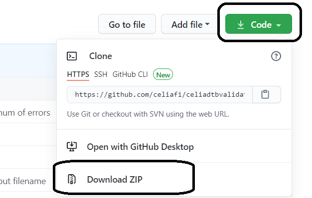
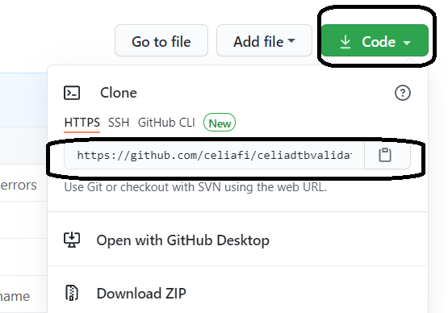
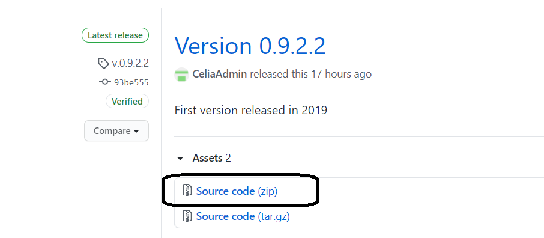
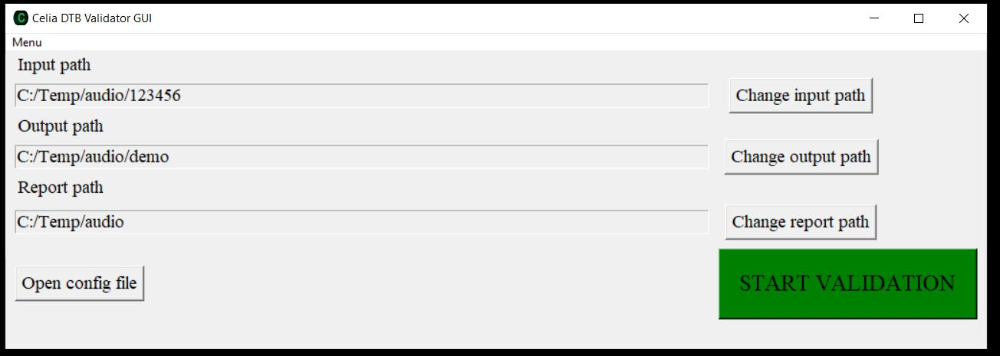
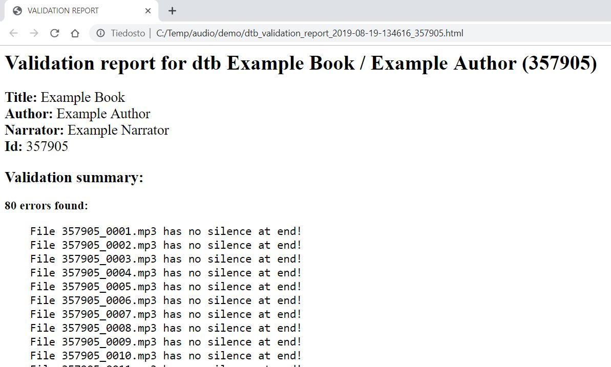
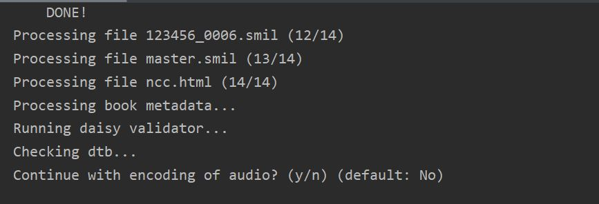

# Celia DTB Validator

E-book and audiobook validation tool

## Introduction

### What does the Celia DTB Validator do?

The Celia DTB Validator analyses files for their digital peak level, true peak (ISP) level, signal-to-noise ratio and LUFS. Validator also looks for unexpected silences in files and checks that there is silence at end of file and no silence at start of file. If examined book is Daisy it is also possible to validate book using Daisy Pipeline Validator light. It is also possible to encode audio of a Daisy book to mp3 using Daisy Pipeline.

### Validations performed

#### Audiofile validations
- Lufs, pkdb, tpkdb, snr levels are in valid range
- Lufs does not change noticeably between two files
- There is enough silence at end of file
- There is not too much silence at end of file
- There is sound at beginning of file
- There are no unexpected silences at middle of file

#### Daisy validations
- ncc.html file exist
- smil-files exist
- filename prefix matches dc:identifier
- Number of smil files is same as number of audio files
- master.smil file exists
- Only one phrase in the first heading
- ncc.html encoded to certain character encoding
- Metadata fields not left empty
- Page numbers not found at first phrase of heading
- Daisy pipeline 1 Daisy 2.02 Validator light validation

## Installation

### Prerequisites

Celia DTB Validator is designed to work on Windows 10, using Python 3.8.7. (newer python3 versions should also work)

For audio and Daisy validation it is required that following programs are also installed:
- Python 3.8.7 (or newer)
- FFmpeg 4.4 (or newer)
- Daisy Pipeline 1 v. 20111215
- Java JRE 11 (should install automatically when installing Pipeline?) (note: in test environment we use AdoptOpenJDK Java JRE 8, and it also does work)

Other version might also work, but have not been tested and might not work.

If validation is done for audio only, Daisy Pipeline is not required.

Please refer to the documentation of the programs mentioned for more information
on installation and usage.

The script expects FFmpeg to be in PATH, ie. so that it works with command 'ffmpeg', so evironment variable needs to be set for it.

It is also to be noted that FFmpeg might also require aditional modules to
be installed in order for them to be able to work with files in mp3 format (or flac, ogg, ...). Mp3 support has not been tested while development as the program is primarily meant as validating wav files. Please refer to documentation provided by FFmpeg for more information.

Also should be noted, that pipeline uses Java, so that must also be installed,
if validating Daisy books. Pipeline also does expect Java to be in in PATH, ie. so that it works with command 'java', so evironment variable needs to be set for it also. Pipeline 1 projects documentation recommends Java 11, but in development and testing environment, we have used Java 8, and it also does seem to work ok (atleast now in may 2021).

### Downloads

Newest version of Celia DTB Validator can be downloaded from github as a zip:



...or by cloning it with git, using for example https that can be seen in project page:



with command

```
git clone https://github.com/celiafi/celiadtbvalidator.git
```

Archived older releases can be downloaded as zip from releases page



### Installation

For installation of Celia DTB Validator the files can be placed in any location.
Celia DTB Validator is written in pure Python3 and does not require any additional
Python modules to run. Usage of virtualenv is always a good practise, but it is not really needed here as there are no additional third party python modules needed.


## Usage

For basic usage use validator_gui.py to run Celia DTB Validator GUI.

For advanced usage use celia_dtb_validator.py from cmd or Powershell.

### Key concepts

These are the key consepts in Celia DTB Validators usage:

**Input path:**  
Path to the folder containing book to be validated  
**Output path:**  
Path to folder where encoded book is placed (if audio encoding is enabled)  
**Report path:**  
Path to folder where validation report is stored  
**Config file:**  
File where all variables (for example valid LUFS values etc.) can be set and where audio and daisy validations and audio encoding can be enabled/disabled. Config file is located on the same folder as the file celia_dtb_validator.py.

### Graphical user interface



Minimalistic GUI enables user to define all paths, open the config file for editing and to start the validation.

Validation output is shown on Python3 prompt. After validation is finished the report is shown in users
default webbrowser.



After examining the report the user can then decide wheter or not to proceed with audio encoding.



### Command line interface

Command line interface can be run with following command:

```
python celia_dtb_validator.py -i BOOKPATH [-o OUTPUTPATH] [-r REPORTPATH]
```

There is also parameter -h to print basic usage info and -v to print version number.

**NOTE ON PATHS WITH SPACES:**
If you use paths with spaces you should leave out the last backslash. The last backslash will be interpreted as escape character.
Use 'C:\Temp\Path With Spaces' instead of 'C:\Temp\Path With Spaces\'

You can also use double quotes ie. "'C:\Temp\Path With Spaces\'", or use forward slahes instead, ie. 'C:/Temp/Path With Spaces/'

### Configuration

All setting can be configured using the config.txt file.

Following configurations can be set:

- audio validation (on/off)
- daisy validation (on/off)
- open reports after validation (on/off)
- encode audio (on/off)
- target kbps
- target text encoding
- lufs min
- lufs max
- pkdb min
- pkdb max
- tpkdb min
- tpkdb max
- snr min
- silence db
- end silence min
- end silence max
- start silence max
- mid silence max
- max volume level flux
- pipeline path
- FFmpeg path
- java path

Please see [config.txt](config.txt) for more information.

Note: If you mess up your configuration file a new one is generated automatically, if you delete or rename the current config.txt file.

### Examples

#### Daisy production example
1. Record book as usual.
2. Regenerate book using book id as file name prefix (optional)
3. Change dc:identifier on (regenerated) books ncc.html to book id  
   (optional - dc:identifier is used as mp3 encoded books foldername  
   (if empty folder is named as 'mp3'))  
4. Run validation on (regenerated) book using folowing configurations  
    audio_validation = 1  
    daisy_validation = 1  
    encode_audio = 1  
    target_kbps = 64 (or some other value)  
5. Examine validation report
6. Validator ask if you wish to continue with audio encoding  
    if there are errors -> answer no and fix them on original book and do steps 2-5 again  
    if no errors are found -> answer 'y'  
7. After encoding the encoded audio book is in output-folders


#### Daisy and audio validation example
1. Run validation on any Daisy book using folowing configurations  
    audio_validation = 1  
    daisy_validation = 1  
    encode_audio = 0  
2. Examine validation report  
    if there are errors -> fix/report them etc.


#### Mp3 playlist audiobook audio validation
1. Record audio and generate playlist as usual
2. Run validation on folder containing audio files using folowing configurations:  
    audio_validation = 1  
    daisy_validation = 0  
    encode_audio = 0 (optional -> disabling daisy validations automatically disables audio encoding)  
3. Examine validator report  
    if there are errors -> fix errors and do steps 1-3 again


#### Batch validate all daisy books in a folder
1. Put all books in one folder
2. Use folowing configurations:  
    audio_validation = 1  
    daisy_validation = 1  
    encode_audio = 0  
3. Run following Powershell command:  
    $dtbs = ls -Directory -Path PATHTOFOLDER | % { $_.FullName } ; foreach ($dtb in $dtbs) {python PATHTOVALIDATOR\celia_dtb_validator.py -i $dtb -r PATHTOFOLDER}  
4. Reports are opened into default webbrowser in tabs and stored into PATHTOFOLDER.

## License

    This program is free software: you can redistribute it and/or modify
    it under the terms of the GNU General Public License as published by
    the Free Software Foundation, either version 3 of the License, or
    (at your option) any later version.

    This program is distributed in the hope that it will be useful,
    but WITHOUT ANY WARRANTY; without even the implied warranty of
    MERCHANTABILITY or FITNESS FOR A PARTICULAR PURPOSE.  See the
    GNU General Public License for more details.

    You should have received a copy of the GNU General Public License
    along with this program.  If not, see <http://www.gnu.org/licenses/>.
